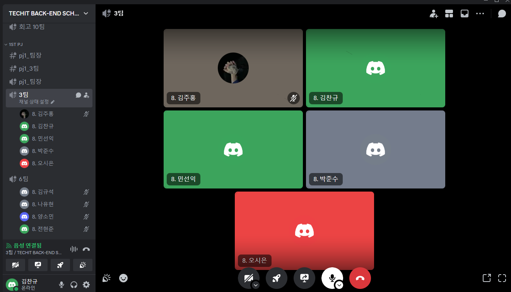

## 팀 구성원, 개인 별 역할

프로젝트 팀 구성원을 기재해 주시고, 그 주의 팀원이 어떤 역할을 맡아서 개발을 진행했는지 구체적으로 작성해 주세요. 🙂 

- 해당 역할을 그대로 따를 필요는 없습니다!

- 김찬규: JWT 인증 기능 개발, 네이버 API 기능 개발, 코스 제작/조회 기능 
- 김주홍: postman 로그인/회원가입 설정, 게시판 뼈대 작성, member Controller 로그아웃 구현, Service에서 이메일 인증용 코드, 유저가 입력한 코드 검사 구현
- 민선익 : 한국관광공사 TourApi 연동, 여행지 정보 받아오기 기능 개발, 여행지 프론트 개발
- 박준수: 이메일 전송, 인증 기능 개발, Redis 생명주기 관련 기능 개발, 
 JWT 생명주기 관련 기능 개발
- 오시은: 게시판 기능 구현

## 팀 내부 회의 진행 회차 및 일자

예) 1회차(2024.03.18) 구글 밋 진행, (OOO님 불참)

- 일주일 간 진행한 내부 회의 횟수와 일자, 진행 방법, 불참 인원을 위와 같이 작성해 주세요.

## 현재까지 개발 과정 요약 (최소 500자 이상)

현재까지 진행하고 있는 개발 현황을 기능별 목표, 목표달성률, 성과자체평가(상세히) 작성해주세요.

- 성과자체평가는 ‘기술적으로 새로 알게된 점, 어려웠던 점, 아쉬운 점, 시도해볼 점' 등을 작성해 주시면 됩니다 🙂
- 팀원 각자 현재 구현하고 있는 것을 적어주세요. :)
- ex) 기능별 목표: 암기장 삭제하기 기능 추가 / 목표달성률: 50% - 마켓에서 등록해제는 가능, 내 암기장 삭제는 아직 미구현 / 지속적으로 수정사항이 발생하여 완성도를 올리는 중, 현재 관련 문서 참고 중

### 기능별 목표
- 김찬규 :
    - api 개발: 네이버의 지역검색 api를 사용한 개발은 완료했으나 기능 부족으로 인해 TourApi로 갈아탸아할 것 같다.
    - 코스 기능 개발: 코스 등록/조회 기능 개발을 거의 했으나 Place를 언제 저장해야할지, Place 개발을 맡고계신 선익님과 의논을 잘 해봐야겠다.
    - 목표 달성률 : 20%
- 민선익 :
    - API 연동하기: 80% - 추후에 부가적인 기능(카테고리, 지역코드별 조회, 정렬 기준 등)을 포함시킬 수도 있다.
    - 여행지 정보 받아서 저장할 수 있도록 구현하기  / 0 %
    - 화면에 여행지 리스트가 보이도록 프론트 구성하기  / 0 %
- 박준수 : 
    - Admin:
        회원 목록 조회, 회원 차단/차단해제, 로그인시 이메일 인증, 비밀번호 찾기 이렇게 꼭 필요하다고 생각하는 기능만 빠르게 개발할 생각입니다.
    - Auth:
        주홍님이 하고 있는 로그인, 비밀번호찾기 등 이러한 부분 같이 개발할 생각 입니다. view는 중간중간 시간나면 간단하게만 만들 생각입니다.
    - 목표 달성률 : 20% - 유저 조회 기능만 구현한 상태 

### 성과 자체 평가
- 민선익
    - 한국관광공사에서 제공하는 국문 관광 정보 서비스라는 오픈 API를 이용하여 키워드로 여행지 검색, 컨텐츠 ID 로 여행지 상세 정보를 조회할 수 있는 기능을 구현하였습니다.
    - 이번 구현을 통해서 수업 시간에서도 다뤘었지만 여러 REST API Client 방식들의 차이점을 잘 알게 되었습니다. 이로써 API 를 사용하는 방법을 조금 익혔다정도인것 같습니다.
    - 아쉬웠던 점은 많은 코드를 작성하지 못했다는 점입니다. 전체 흐름을 잘 파악해서 적재적소에 필요한 기능들을 추가하고 살을 붙여나가는 능력이 부족한것같습니다. 그떄마다 찬규님이 많은 도움을 주셔서 수월하게 진행될수 있었던 것 같습니다.
    - 여행지 정보 부분을 잘 마무리 짓고 빠르게 프론트 작업을 끝낼 수 있도록 할 예정입니다.
- 박준수
    - 기술적으로 알게된 점: 이메일 인증 관련해서 어렵게만 생각했는데 전송관련 부분은 손댈거 없이 가져다 쓰기만할 수 있어서 생각보다 수월했다.
    - 어려웠던 점: PR을 꼼꼼하게 읽어봤는데도 막상 로컬에서 실행해보니 에러가 나서 어려웠다.
    - 아쉬운 점: 프론트엔드쪽 규모가 너무 커진 것 같아서 전부 구현하기 어렵다는 점이 아쉽다.
    - 시도해볼 점: 이메일 인증시 보내는 메일 템플릿이 마음에 들지 않아서 시간이 남는다면 바꿔볼 생각이다.
- 
    - 

## 개발 과정에서 나왔던 질문 (최소 200자 이상)
개발을 진행하며 나왔던 질문 중 핵심적인 것을 요약하여 작성해 주세요 🙂

- 질의응답 과정 중 해결되지 않은 질문을 정리하여도 좋습니다.

---
- 민선익님: 한국관광공사 API 실행이 안되는 문제 해결이 안됨
    - 김찬규: API Secret 키를 Decoding 버전으로 사용하지 말고, Encoding 버전으로 사용하면 작동됨
- 김찬규: (강사님께) ChatGPT 사용하는것 어떻게 생각하시는 지
    - 강사님: 코드를 생성하는 정도의 수준이 아니라, 어떻게 접근해야할지 키워드를 가지고 지식을 알아가는 정도면 사용해도 괜찮다.
      프론트에 있어서는 코드 생성 정도로 사용해도 괜찮다.
- 김찬규: (강사님께) Postman을 사용해서 Bearer Token으로 인증하는건 지난 과제에서 진행해보았는데 실제 웹에서는 어떻게 인증 절차를 거치는지 모르겠다.
    - 강사님: 백엔드 스쿨이지만 이번에 Front에 대한 공부도 필요하게 될 것, 자바스크립트를 사용해야함.
      그러나 정 어렵다면 인증절차를 생략하고 개발하는 것도 좋음

## 개발 결과물 공유

Github Repository URL: https://github.com/like-lion-3team/trip

- 필수) 팀원들과 함께 찍은 인증샷(온라인 만남시 스크린 캡쳐)도 함께 업로드 해주세요 🙂

